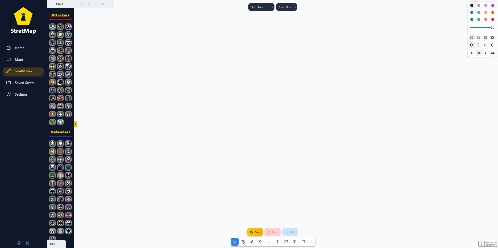

# StratMap


**StratMap** is an interactive strategy planner for Rainbow Six Siege. It allows players to visually create, save, and share tactical plans for any map. Think of it as a digital whiteboard for planning operator positions, objective locations, and team strategies.

---

## Features

- 🔨 **Interactive Maps**: Select maps and floors to plan strategies.
- 🔍 **Operator Icons**: Drag-and-drop operator icons onto maps.
- 🎨 **Whiteboard Canvas**: Use Tldraw as a whiteboard-like editor to create exactly what you want.
- 💾 **Save & Load Strats**: Save your strategies locally and load them anytime.
- 📊 **Filter & Search**: Easily find saved strategies by name, map, or date.
- 📄 **Multi-floor Support**: Use Tldraw pages to plan multiple floors of the same map.
- 📱 **Mobile Responsive**: Works on both desktop and mobile devices.

---

## Screenshots

  
_View and manage your saved strategies._

  
_Drag operators and plan your strategies visually._

---

## Motivation

Gaming has been a huge part of my life for as long as I can remember, one of my favourite series being the Tom Clancy's Rainbow Six games. I have played a lot of Siege in particular and have always wanted to be more competitive like the game was designed to be. So when starting this project I knew I wanted it gaming focused and helpful to my friends, the public, and I. This is what I landed on, a tool that can help bring your teammates together and form a competitive strategy to use in your games.

---

## Tech Stack

### Frontend:

- React
- Tailwind CSS
- ShadcnUI
- Lucide Icons

### Built With:

- Vite
- TypeScript

### Deployed On:

- Railway - https://stratmap.xyz/

---

## Future Plans

- Real time collaboration
- Unique Share links
- User Accounts

---

## Credits

Huge thank you to my coach Lucas Hillier for all of his help, guidance, and insights. And thank you to the Get Coding program as a whole for offering this amazing program in the first place!

---

## Contact Info:

- Linked In - https://www.linkedin.com/in/carter-marsh-21b569184/
- Email - carter-205@hotmail.com

---

## 🚀 Installation & Setup

Follow these steps to get the project running locally:

### 1. Clone the repository

```bash
git clone https://github.com/Cmarsh205/stratmap.git
cd stratmap
```

### 2. Install Dependencies

```bash
npm install
```

Or if you prefer:

```bash
yarn install
```

### 3. Start The Development Server

```bash
npm run dev
```

### 4. Build For Production

```bash
npm run build
```

### 5. Preview The Production Build

```bash
npm run preview
```

---
