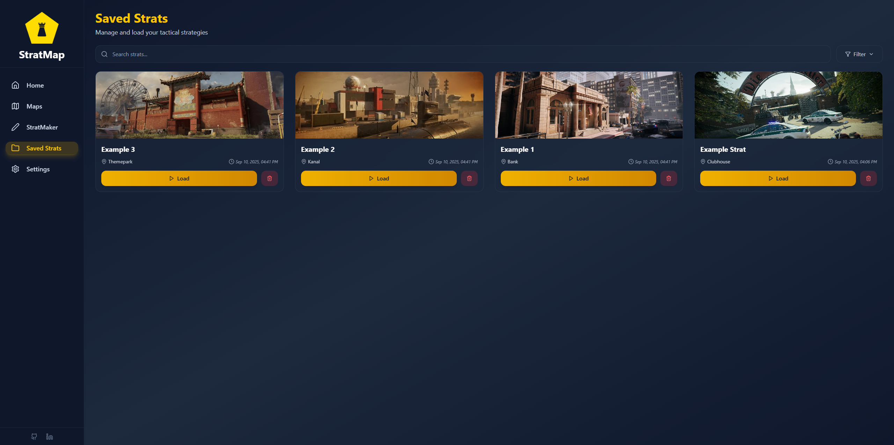

# StratMap

**StratMap** is an interactive strategy planner for Rainbow Six Siege. It allows players to visually create, save, and share tactical plans for any map. Think of it as a digital whiteboard for planning operator positions, objective locations, and team strategies.

---

## Features

- 🔨 **Interactive Maps**: Select maps and floors to plan strategies.
- 🔍 **Operator Icons**: Drag-and-drop operator icons onto maps.
- 🎨 **Whiteboard Canvas**: Use Tldraw as a whiteboard-like editor to create exactly what you want.
- 💾 **Save & Load Strats**: Save your strategies locally and load them anytime.
- 📊 **Filter & Search**: Easily find saved strategies by name, map, or date.
- 📄 **Multi-floor Support**: Use Tldraw pages to plan multiple floors of the same map.
- 📱 **Mobile Responsive**: Works on both desktop and mobile devices.

---

## Screenshots

  
*View and manage your saved strategies.*

  
*Drag operators and plan your strategies visually.*

---

## Motivation

Gaming has been a huge part of my life for as long as I can remember, one of my favourite series being the Tom Clancey's Rainbow Six games. I have played a lot of Siege in particular and have always wanted to be more competitive like the game was designed to be. So when starting this project I knew I wanted it gaming focused and helpful to my friends, the public, and I. This is what I landed on, a tool that can help bring your teammates together and form a competitive strategy to use in your games.

---

## Tech Stack

# Frontend:
  * React
  * Tailwind CSS
  * ShadcnUI
  * Lucide Icons

# Built With:
  * Vite
  * TypeScript

# Deployed On:
  * Railway - https://stratmap.xyz/
